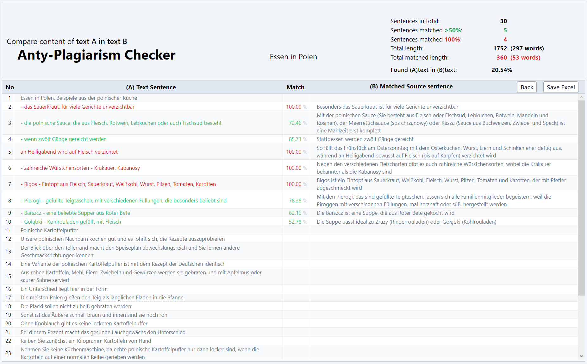

<p align="center"><a href="https://laravel.com" target="_blank"></a></p>


# Anty-Plagiarism Checker 

Anty-Plagiarism Checker for cases when we're not sure whether a text (A-Text) is a new created text or it was copied from another text (e.g. B-Text).
So, this app allows us to check whether A-Text is in whole or partially present in B-Text.<br/>
Every sentence of the first text is being compared against every sentence in the second text, word after word.



## Features
The comparing results:
- overview of sentence matching list
- comparison statistics
- report-export to Excel file

## Usage
Put in a comparison name and insert the texts to be compared:
- insert the text to be checked into the A textarea
- insert the second text into the second B textarea

For security reasons the last field has to stay empty (as anty-bot protection).

After comparing on the next screen we will see:
- a list of all sentences from the first text and, if exist, matching sentences from the second text
- statistics related to the number and length of matched sentences
- the general matching ratio

The sentence list and the stats can be saved as Excel file (_Save Excel_ button).

### Stats
 The final statistic gives:
- total number of A-Text sentences
- number of A-Text sentences for which there are similar/identical sentences in B-Text (ratio >=50%)
- summarized A-Text words length
- summarized matched A-Text words length
- total matching percentage of A-Text present in B-Text

## Architecture
### Laravel quasi-module
This app is configured as separated Laravel module under `/src/aplag` folder. Its entry point provider `AplagServiceProvider` is registered in the application `AppServiceProvider` and the routes config file _`routes_web.php`_ in the application `RouteServiceProvider`.

Finally, the name _Aplag_ is added to namespaces and paths under 'psr-4' in _`composer.json`_.

### Hexagonal architecture
Further, the app is Hexagonal-structured:
- `App` - for http related controllers, requests, views requiring access to the application
- `Domain` - DTOs, domain entities/models, services and interfaces (primary/secondary ports, here `PortsIn` and `PortsOut`)
- `Infra` - implementations of domain secondary ports
```
src
|
+---aplag
|   |
|   +---App
|   |   |
|   |   +---Http
|   |   +---Controllers
|   |   +---Requests
|   |   +---views
|   |   |
|   +---Domain
|   |   |
|   |   +---DTOs
|   |   +---Entities
|   |   +---PortsIn
|   |   +---PortsOut
|   |   +---Services
|   |   |
|   +---Infra
|   |   |
|   |   +---CompTextCreator
|   |   +---ExcelExporter
|   |   +---ReportCreator
|
```
The controllers (`App` folder) use injected domain interfaces (primary ports, here `PortsIn`) and so they are decoupled from the domain specific services.
Likewise, the domain services use only interfaces (secondary ports, here `PortsOut`) and know nothing about their implementations (secondary adapters, services in folder `Infra`).

All dependencies are provided by module provider `AplagServiceProvider`, which contains bindings of interfaces -> specific classes.

## What was used
- Laravel 10
- PHP 8.2
- Tailwindcss
- Javascript

## Required packages
- PhpSpreadsheet (export to Excel file)

## Working version
[https://app.deadygo.com/aplag](https://app.deadygo.com/aplag)
